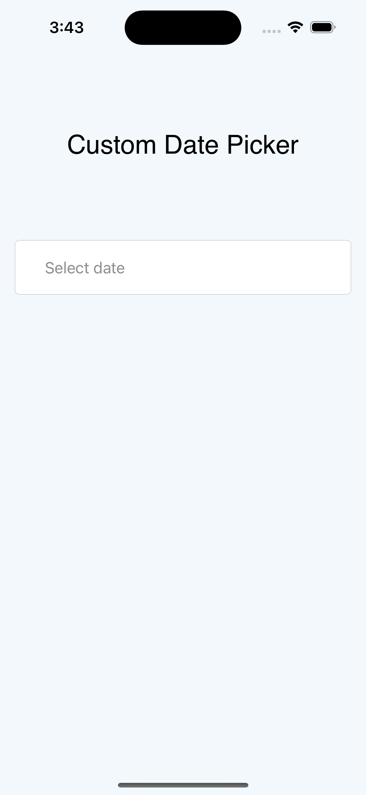
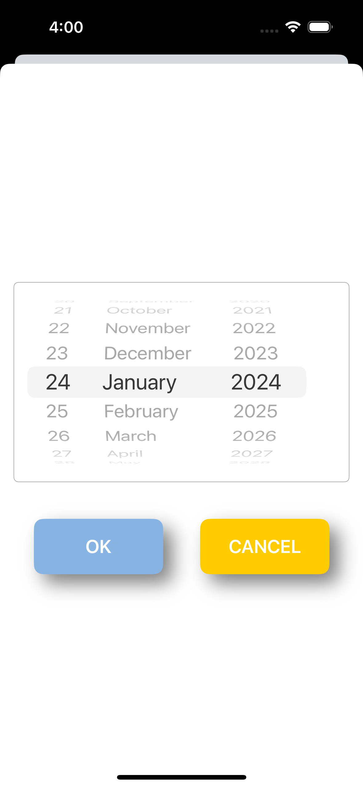

# Hello! 
This repository functions as a dynamic showcase of my latest passion project—an innovative custom date picker view that I've meticulously crafted. Take a stroll through the codebase and explore the intricacies of this novel date picker, designed to elevate user experiences in SwiftUI applications. Your curiosity is welcome, and feel free to delve into the details. Stay tuned for the upcoming release on GitHub, where I'll be sharing this custom date picker with the public. Watch this space for an immersive exploration into the world of Swift UI and intuitive date picking functionalities 
 

 
 

